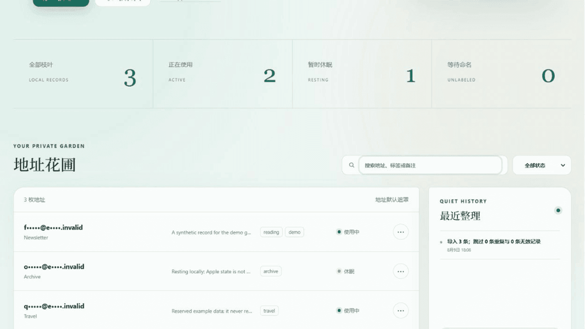
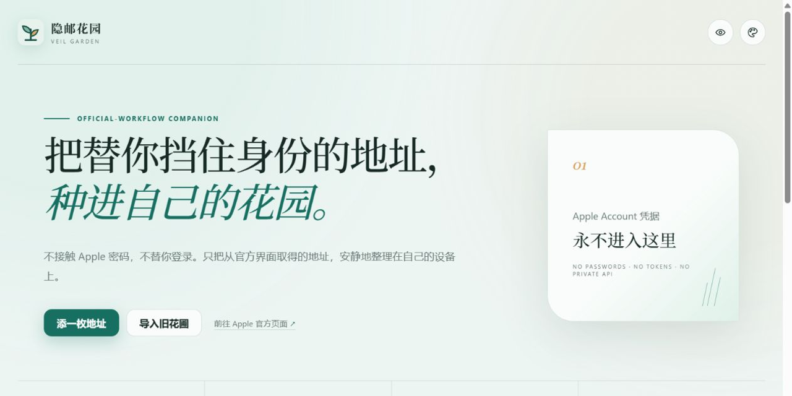

# Veil Garden · 隐邮花园

<p align="center">
  
</p>

<p align="center">
  <a href="https://github.com/ferretgeek/VeilGarden/actions/workflows/ci.yml"></a>
  <a href="https://github.com/ferretgeek/VeilGarden/actions/workflows/codeql.yml"></a>
  
  
</p>

> Tend every address that stands between your identity and the world—in a garden that stays yours.

Veil Garden is a local-first organizer for user-provided Hide My Email addresses. You still create addresses through Apple's official interface; Veil Garden handles safe import, masked-by-default browsing, labels, notes, local status, search, and portable backups. It never accepts Apple Account passwords, verification codes, cookies, or tokens, and it does not call undocumented Apple APIs.

[中文](./README.md) · [Deployment](./docs/DEPLOYMENT_EN.md) · [Privacy & security](./docs/PRIVACY.md) · [Issues](https://github.com/ferretgeek/VeilGarden/issues)

## At a glance

<p align="center">
  
</p>

<p align="center">
  
</p>

- **Organize without taking over:** add records manually or import TXT / CSV; Apple sign-in and address creation stay with Apple.
- **Private by default:** addresses are masked, full export requires an exact confirmation phrase, and the access token only lives in page memory.
- **A complete workflow:** search, labels, notes, active/resting state, duplicate filtering, local events, and CSV / JSON / TXT export.
- **Local and server ready:** Python standard library runtime plus Docker, systemd, SSH-tunnel, and HTTPS reverse-proxy paths.
- **Four global themes:** Sky, Jade, Sunset, and `#17191d` Graphite, with responsive desktop and mobile layouts.

## Security boundary

| Veil Garden does | Veil Garden never does |
| --- | --- |
| Store addresses, labels, and notes deliberately supplied by the user | Ask for or store an Apple Account password, 2FA code, cookie, session token, or trust token |
| Mark records active or resting in the local database | Change Apple-side state, automate address creation, or bypass platform limits |
| Link to Apple's official support workflow | Reimplement Apple's private web authentication or internal APIs |
| Export masked data by default and require explicit confirmation for full data | Upload addresses, databases, or access tokens to a third party |

Apple's official creation and management steps are documented by [Apple Support](https://support.apple.com/guide/icloud/create-and-edit-addresses-mm1a876f7aed/icloud). Veil Garden is an independent, unofficial community project and is not affiliated with, authorized by, or endorsed by Apple.

## Run locally in three minutes

Python 3.10 or newer is required.

```bash
python -m venv .venv
```

Windows PowerShell:

```powershell
.\.venv\Scripts\Activate.ps1
python -m pip install .
veil-garden
```

macOS / Linux:

```bash
source .venv/bin/activate
python -m pip install .
veil-garden
```

The terminal prints a local URL containing `#token=...`. URL fragments are never sent to the server; the frontend reads it once, removes it from the address bar, and never writes it to `localStorage` or `sessionStorage`.

Try reserved synthetic data:

```bash
veil-garden --demo
```

Demo mode only uses the reserved `example.invalid` domain.

## Import format

Use one address per line, with optional local label and tags:

```text
quiet.leaf@example.com
paper.lantern@example.com | Reading | newsletter,weekly
```

The server accepts at most 5,000 records and 256 KiB per import. Address uniqueness is case-insensitive. Status, labels, and notes stay local and are never synchronized to Apple.

## Server deployment

Public access must sit behind an HTTPS reverse proxy with a strong access token of at least 24 characters and an exact Host allowlist. Minimal Docker flow:

```bash
cp .env.example .env
python -m veil_garden token
docker compose up -d --build
```

Put the generated value in `.env` as `VEIL_ACCESS_TOKEN`, then follow the [deployment guide](./docs/DEPLOYMENT_EN.md) for an SSH tunnel or HTTPS. Never commit `.env`, `data/`, the SQLite database, or exports.

## Data and limitations

- Production mode stores data in `data/veil-garden.sqlite3` by default. The database contains full addresses and notes; it is **not an encrypted vault**. Restrict file permissions and use encrypted disks and backups.
- Resting and removal only affect local records. Use Apple's official interface to deactivate, reactivate, or delete an Apple-side address.
- There is no telemetry, advertising, cloud sync, or third-party runtime asset.
- Runtime code uses only Python's standard library; the interface is native HTML, CSS, and JavaScript.

## Development and verification

```bash
python -m pip install -r requirements-dev.txt
python -m unittest discover -s tests -v
ruff check .
ruff format --check .
bandit -r src -ll
```

Release gates also cover pip-audit, detect-secrets, Gitleaks on the current tree and full history, fresh-clone testing, Wheel installation, real desktop/mobile rendering, image metadata, and public GitHub settings. See the [release audit](./docs/发布审计.md).

## License

Original code is available under the [MIT License](./LICENSE). Apple, iCloud, iCloud+, Hide My Email, and related marks belong to their respective owners; this license grants no rights to third-party brands or services.
